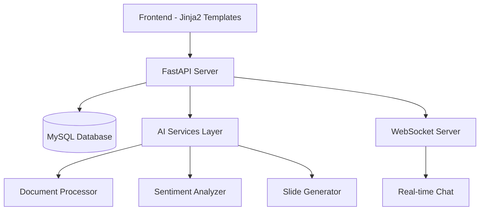

# WorkSphere AI - AI-Powered Employee Management System


A Final Year Project by **Apil Thapa** (London Met ID: 22067753)  
*Under the guidance of Mr. Alish Kc and Mr. Samrat Thapa*

---

## 🚀 Project Overview
**WORkSphere AI** revolutionizes traditional workforce management by integrating AI capabilities for:
- 🤖 Smart employee onboarding with **PIN-based activation**
- 📊 Real-time task management & progress tracking
- 📝 AI-powered document querying & summarization
- 😊 Sentiment analysis of employee feedback
- 📸 Facial recognition-based attendance system
- 💬 Secure real-time chat with WebSocket integration

---

## 🌟 Key Features

### Employee Features
- 🧑💼 Role-based dashboards
- 📅 AI-generated meeting slides from text input
- 📈 Task submission & progress tracking
- 🔍 Document querying using natural language
- 💡 Feedback submission with anonymity
- 👥 Department-wide social posts & interactions

### Manager Features
- 👑 Employee registration approval system
- 🎯 Task assignment & performance monitoring
- 📢 Priority-based announcements
- 📉 Sentiment analysis dashboard
- 🔒 Role-based access control
- 📊 Real-time analytics & reports

---

## 🛠️ Technologies Used

### Core Stack
**Backend**  


**Frontend**  


### AI/ML Integration


---
## 🛠️ System Architecture  

🤖 **Setup sentiment analysis model**
  ```bash
  clone the model repo go inside the model main folder move the inner sentimentModel directory to the main project folder
     git clone git clone https://huggingface.co/Jevvan123/sentimentmodel
  ```

## 🛠 Installation Guide

### Prerequisites
- Python 3.8 or higher
- MySQL Server 8.0+
- XAMPP (for local development)
- Git version control

  
### Step-by-Step Setup
1. Clone the repository

```bash
git clone https://github.com/Apiljungthapa/WorkSphere-AI.git
cd WorkSphere-AI
```

2. Create and activate virtual environment

```bash
python -m venv venv
# On Windows:
venv\Scripts\activate
# On Linux/Mac:
source venv/bin/activate
```

3. Install dependencies

```bash
pip install -r requirements.txt
```

🔑 **Configure API key**
  ```
  5) Create a .env file in the root directory and add:
    GOOGLE_API_KEY=your_api_key_here
  ```
  Get your API key from [Google AI Studio](https://aistudio.google.com/apikey)
  

## 💾 Database Setup

1. Install and launch XAMPP from Apache Friends
2. Start Apache and MySQL services
3. Access phpMyAdmin at https://www.phpmyadmin.net/downloads/
4. Create a new database named `ems2`
5. Import the database schema:
   - Select the `ems2` database
   - Navigate to the Import tab
   - Choose the `ems2.sql` file from the project directory
   - Click Execute to import the schema

## ⚙ Configuration

1. Create a `.env` file in the root directory with the following content:

```ini
DB_HOST=localhost
DB_USER=root
DB_PASSWORD= ''
DB_NAME=ems2
GOOGLE_API_KEY=your_actual_api_key_here
SMTP_SERVER=smtp.gmail.com
SMTP_PORT=587
SENDER_EMAIL=
HR_SENDER_PASSWORD=
MANAGER_SENDER_PASSWORD=
```

## 🚀 Running the Application

1. Ensure XAMPP services (Apache and MySQL) are running
2. Start the FastAPI server:

```bash
uvicorn main:app --reload
```

3. Access the application in your browser at:
   - http://localhost:8000

## 🔧 Technologies Used

### Core Stack
| Component | Technology |
|-----------|------------|
| Backend Framework | FastAPI (Python) |
| Database | MySQL |
| ORM | SQLAlchemy |
| Real-time | WebSockets |

### Frontend
- Jinja2 Templating Engine
- HTML5, CSS3, JavaScript
- Bootstrap 5 for responsive design
- Chart.js for data visualization

### AI Components
- HuggingFace Transformers (Sentiment Analysis)
- Google Gemini API (Document Processing)
- Custom ML models for analytics

## 📜 License

This project is licensed under the MIT License. See the LICENSE file for full details.

---

Developed by: Apil Thapa  
Institution: London Metropolitan University  
Student ID: 22067753  
Supervisors: Mr. Alish Kc & Mr. Samrat Thapa  
Academic Year: 2022-2025

